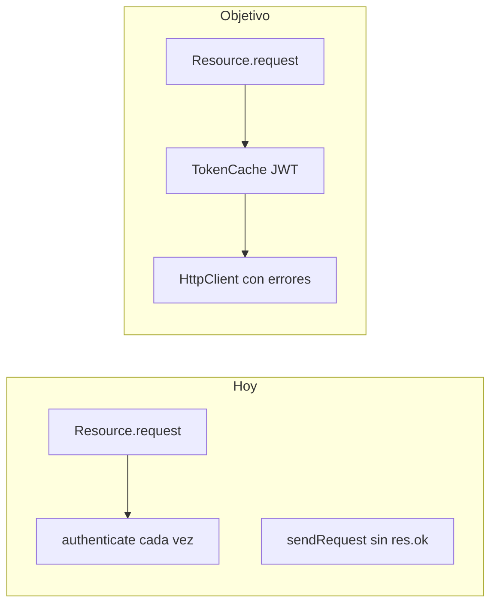

# Especificación en `references/` para epayco-sdk-node-ts

## Objetivo del entregable

Crear **un único archivo de spec** en la carpeta `[references/](references/)` (nombre recomendado: `**EPAYCO_NODE_TS_DEVELOPMENT_SPEC.md`**) que sirva como **fuente de verdad** para priorizar y ejecutar mejoras. El documento debe estar en **español, con secciones numeradas, tablas donde aporte claridad, y referencias cruzadas a archivos del repo (no duplicar los 13k líneas del OpenAPI; enlazar `[references/epayco-openapi.yaml](references/epayco-openapi.yaml)` y la colección Postman).

**Nota de modo plan:** este plan describe el **contenido obligatorio** de ese archivo; la escritura física del `.md` en `references/` corresponde al paso de implementación tras tu confirmación.

---

## Estructura obligatoria del documento spec

### 1. Metadatos y control

- Título, versión del documento (ej. `0.1.0`), fecha, estado (`Draft` / `Approved`).
- Alcance: rama objetivo (`develop`), paquete npm `[package.json](package.json)` (`epayco-sdk-node-ts`).
- Fuentes normativas: OpenAPI, Postman, informes existentes `[references/TECH_REPORT.md](references/TECH_REPORT.md)`, `[references/CURSOR_REPORT.md](references/CURSOR_REPORT.md)`.

### 2. Visión y límites (non-goals)

- **Visión:** SDK tipado, mantenible, con paridad progresiva con ApiFy/legacy y DX predecible.
- **Non-goals explícitos:** reemplazar el dashboard ePayco; soportar mutual TLS en v1 del spec salvo decisión explícita; garantizar paridad 100% de todos los paths del OpenAPI en una sola release.

### 3. Estado actual (resumen ejecutivo)

- Resumen en 1 página: stack (tsup, Vitest, Biome, `fetch`), patrón Facade + `[src/resources/resource.ts](src/resources/resource.ts)`, tres bases URL `[src/constants.ts](src/constants.ts)`.
- Lista de **recursos implementados** vs **dominios en OpenAPI** (tabla de alto nivel, no listado exhaustivo de paths).

### 4. Arquitectura objetivo (referencia)

Incluir un diagrama **mermaid** (texto en el spec) del flujo actual y del flujo objetivo tras mejoras HTTP/auth:

### 5. Requisitos funcionales por epic

Cada epic debe tener: **descripción**, **archivos tocados**, **criterios de aceptación** verificables.

| Epic                    | Contenido mínimo en la spec                                                                                                                                                                                                                  |
| ----------------------- | -------------------------------------------------------------------------------------------------------------------------------------------------------------------------------------------------------------------------------------------- |
| **HTTP y errores**      | Comportamiento ante `!res.ok`, cuerpo no JSON, `success: false` en JSON; nuevas clases de error o contrato documentado en `[src/errors.ts](src/errors.ts)`.                                                                                  |
| **Autenticación**       | Caché de JWT (clave: `apiKey`+`privateKey`+modo apify), TTL/refresh, opción de desactivar caché para tests; impacto en `[src/http.ts](src/http.ts)` y `[src/resources/resource.ts](src/resources/resource.ts)`.                              |
| **IP**                  | Política: `getIp()` opt-in u obligatorio `ip` en prod; variable de entorno documentada.                                                                                                                                                      |
| **Paridad API**         | Backlog priorizado desde OpenAPI: links de cobro (`/collection/link/`_), retiros (`/withdraw/`_), Smart Checkout (`/payment/session/create`), portal cliente (`/client/\`), etc.; cada ítem = método SDK propuesto + host + modo (sw/apify). |
| **Recursos existentes** | Corregir brechas documentadas: `plans.update` ausente vs README; `customers.list` con paginación si la API lo expone; mensajes `[src/data/errors.json](src/data/errors.json)` (códigos 101/102, texto 109 vs proveedores cash).              |
| **Keylang**             | Estrategia: mantener diccionarios + tests de regresión por endpoint; o passthrough documentado; criterio para añadir claves nuevas.                                                                                                          |
| **Webhooks**            | Requisito: utilidad `verifySignature` **solo** si la documentación oficial define algoritmo y cabeceras; si no, sección "bloqueado por documentación externa".                                                                               |
| **Documentación**       | README: nombre de paquete, ejemplos `async/await`, tabla SDK ↔ ruta; opcional TypeDoc en CI.                                                                                                                                                 |
| **Pruebas**             | Contrato: tests de unidad actuales + roadmap para pruebas de integración sandbox (variables de entorno, mocks vs red).                                                                                                                       |

### 6. Roadmap por fases

Definir en la spec **al menos 4 fases** con entregables y orden sugerido:

1. **Estabilización:** README, `errors.json`, métodos faltantes alineados con README, tests mínimos nuevos.
2. **Cliente HTTP + auth:** caché JWT + manejo de errores sin romper compatibilidad (semver: minor vs major documentado).
3. **Paridad prioritaria:** 1–2 dominios elegidos (ej. collection links + withdraw) como plantilla para más recursos.
4. **Hardening:** webhooks (si aplica), validación runtime opcional (Zod), documentación generada.

### 7. Criterios globales de calidad

- `pnpm lint`, `pnpm typecheck`, `pnpm test`, `pnpm build` en CI.
- Política de versionado semver cuando cambie el comportamiento observable (errores lanzados, firma pública).

### 8. Riesgos y dependencias

- Dependencia de documentación ePayco no versionada; cambios de host (`secure` vs `apify`).
- Riesgo de romper integraciones existentes al lanzar excepciones en casos antes devueltos como JSON.

### 9. Preguntas abiertas (para el equipo)

- Prioridad entre dominios del OpenAPI (negocio).
- Si se acepta breaking change en v2.0.0 para errores estrictos.

---

## Relación con archivos ya en `references/`

- No sustituir `[TECH_REPORT.md](references/TECH_REPORT.md)` ni `[CURSOR_REPORT.md](references/CURSOR_REPORT.md)`; la nueva spec los **cita** y los **consolida** en roadmap ejecutable.
- Mantener `[epayco-openapi.yaml](references/epayco-openapi.yaml)` como inventario de paths; la spec puede incluir un **apéndice** con script o proceso manual para regenerar/actualizar el YAML cuando ePayco publique cambios (opcional, no bloqueante).

---

## Formato del archivo

- Markdown estándar, encabezados `##` / `###`.
- Sin emojis (coherente con convenciones del proyecto).
- Longitud orientativa: **8–15 páginas equivalentes** (detalle suficiente sin copiar el OpenAPI completo).
